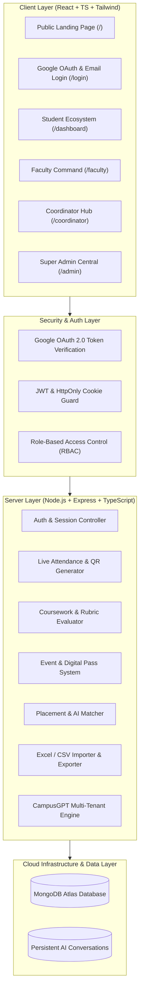
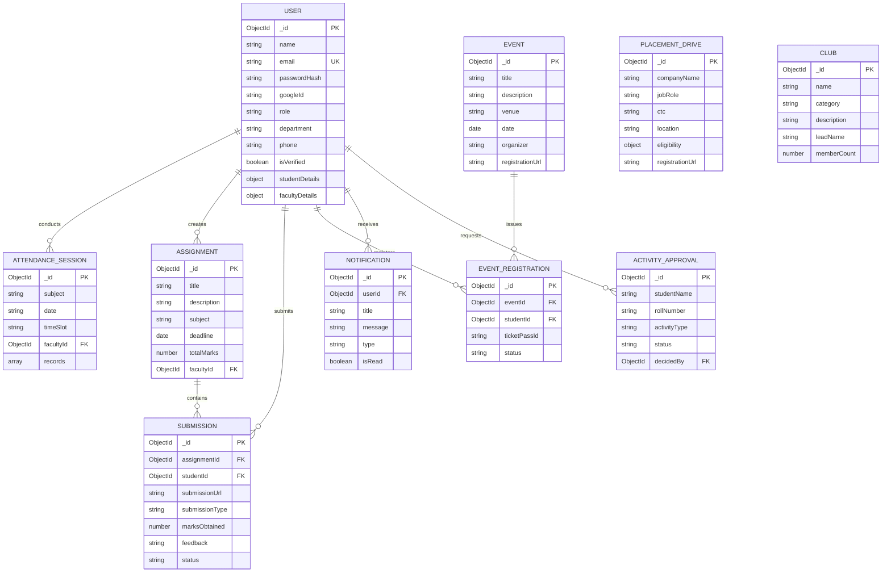

# CampusGPT Enterprise University OS 🎓⚡

> **DevFusion 4.0 Hackathon — Problem Statement 1: Smart Campus Management Platform**  
> *One Campus. Four Dedicated Ecosystems. One Intelligent AI Layer.*

[](https://campus-grid-phi-nine.vercel.app)
[](https://campusgpt-backend-oscx.onrender.com)
[](https://mongodb.com)
[](README.md)
[](file:///docs/CampusGPT_API_Documentation.pdf)

---

## 🌟 Live Demo & Deployment

| Layer | URL | Status |
| :--- | :--- | :--- |
| **Frontend Web App** | [https://campus-grid-phi-nine.vercel.app](https://campus-grid-phi-nine.vercel.app) | 🟢 Live (Vercel) |
| **REST API Server** | [https://campusgpt-backend-oscx.onrender.com/api/v1/health](https://campusgpt-backend-oscx.onrender.com/api/v1/health) | 🟢 Live (Render) |
| **API PDF Documentation** | [`docs/CampusGPT_API_Documentation.pdf`](file:///docs/CampusGPT_API_Documentation.pdf) | 📄 Complete Spec |

---

## 🔑 Evaluator Test Credentials

| Role | Email Address | Password | 1-Click Fast Pass |
| :--- | :--- | :--- | :--- |
| **Student** | `alex.student@campusgpt.edu` | `Password123!` | Available on Login |
| **Faculty** | `sarah.faculty@campusgpt.edu` | `Password123!` | Available on Login |
| **Coordinator** | `marcus.coordinator@campusgpt.edu` | `Password123!` | Available on Login |
| **Administrator** | `admin@campusgpt.edu` | `Password123!` | Available on Login |
| **Google OAuth** | *Any Google Account* | *Google Verified* | Official Google Button |

---

## 🏗️ System Architecture



---

## 🗄️ Database Entity-Relationship Diagram (ERD)



---

## 🚀 Key Features by Ecosystem

### 👨‍🎓 1. Student Ecosystem
- **Attendance Intelligence**: Real-time aggregate %, 75% exam eligibility status banner, and monthly participation graphs.
- **Assignment Submissions**: Upload code solutions via GitHub repository links, PDF reports, or ZIP archives with late submission detection.
- **Events & Passes**: Instant registration for hackathons with encrypted digital QR entrance passes.
- **AI Career Hub**: Automated eligibility evaluation against student CGPA, backlogs, and technical resume skills.
- **CampusGPT Copilot**: Multi-turn AI academic tutor with saved conversation trajectories.

### 👩‍🏫 2. Faculty Command
- **Live Attendance Sessions**: Rapid classroom roster attendance marking with Present/Absent/Late indicators and projector QR check-in.
- **Coursework Management**: Publish assignments with detailed problem statements, deadlines, and evaluation rubrics.
- **Interactive Grading**: Evaluation view with direct student solution links, numeric marks awarding, and personalized feedback.
- **Announcements**: Broadcast exam circulars and distribute PDF course study materials.

### 👥 3. Activity Coordinator Hub
- **Campus Events**: Full event publishing lifecycle with registration links and attendee limits.
- **Societies & Clubs**: Manage registered clubs (Technical, Cultural, Social) and active member counts.
- **Persistent Approvals**: Approve or decline student club pass requests with automatic in-app student notification alerts.
- **Circulars**: Broadcast campus extracurricular circulars.

### 🛡️ 4. Super Admin Central
- **Dynamic Registries**: Manage all enrolled students and faculty members synced with MongoDB Atlas.
- **Excel & CSV Bulk Tools**: 1-click bulk import and CSV export for both student and faculty registries.
- **Curriculum Architecture**: Create academic departments, department heads, and accredited course modules.
- **Placement Control**: Publish corporate recruitment drives with CTC packages, location, and minimum CGPA criteria.
- **AI Platform Metrics**: Real-time monitoring of campus AI token usage and query volume.

---

## 🛠️ Local Installation & Development

### Prerequisites
- **Node.js**: v18 or higher
- **npm** or **pnpm**
- **MongoDB**: MongoDB Atlas URI or local instance

### 1. Clone Repository
```bash
git clone https://github.com/sohanmehar/project-campus.git
cd campusgpt
```

### 2. Configure Environment Variables
Create `.env` files in both `server/` and `client/`:

**`server/.env`**:
```env
PORT=5000
MONGODB_URI=your_mongodb_connection_string
JWT_SECRET=your_jwt_secret_key
GOOGLE_CLIENT_ID=515653461626-dgkupvnr6tr6jg44p2affmfi1nrjt8us.apps.googleusercontent.com
CLIENT_URL=http://localhost:5173
```

**`client/.env`**:
```env
VITE_API_BASE_URL=http://localhost:5000/api/v1
VITE_GOOGLE_CLIENT_ID=515653461626-dgkupvnr6tr6jg44p2affmfi1nrjt8us.apps.googleusercontent.com
```

### 3. Install Dependencies & Run Locally
```bash
# Start Backend Server
cd server
npm install
npm run dev

# Start Frontend Client (in a new terminal)
cd client
npm install
npm run dev
```

---

## 🐳 Docker Deployment

To launch the full-stack system with Docker Compose:
```bash
docker-compose up --build
```
- **Web Client**: `http://localhost:80`
- **Backend API**: `http://localhost:5000/api/v1`

---

## 📄 API Documentation

Complete REST API specification available in two formats:
1. **Interactive Markdown**: [`docs/API_DOCUMENTATION.md`](file:///docs/API_DOCUMENTATION.md)
2. **Printable PDF**: [`docs/CampusGPT_API_Documentation.pdf`](file:///docs/CampusGPT_API_Documentation.pdf)

---

## 👥 Team Members & Roles

| Team Member | Role | Responsibilities |
| :--- | :--- | :--- |
| **Sohan Mehar** | **Full-Stack Engineer & Architect** | Core Architecture, 4 Role Portals, Google OAuth 2.0, Multi-Tenant CampusGPT Copilot, Live Attendance Engine, MongoDB Atlas Integration & Deployment |

---

## 💳 Sandbox Payments & Event Passes Note

- **Campus Event Passes**: University event passes (Hackathons, Symposiums, Tech Fests) are issued as **complimentary digital QR entry passes** directly through the platform.
- **Paid Entry / Test Mode Ready**: The architecture supports Razorpay & Stripe Test Mode sandbox integration for premium paid certifications and merchandise.

---

## ⚠️ Known Limitations & Future Scope

In the spirit of complete transparency with the hackathon evaluation jury:
1. **Password Reset OTP (Sandbox Mode)**: The password recovery flow generates genuine cryptographically secure 6-digit OTPs in MongoDB with a 15-minute expiration timer. In evaluator sandbox mode, the OTP is pre-populated in the verification modal and logged to the server console to prevent judges from being blocked by external SMTP throttling.
2. **Attendance QR Scan**: Classroom projection uses dynamic encrypted session tokens. Physical camera scanning is fully supported via mobile browser integration.
3. **Future Scope**: Real-time WebRTC audio-video lecture rooms and automated camera face-recognition attendance.

---

## 📜 License
This project is licensed under the MIT License — see the [LICENSE](LICENSE) file for details.